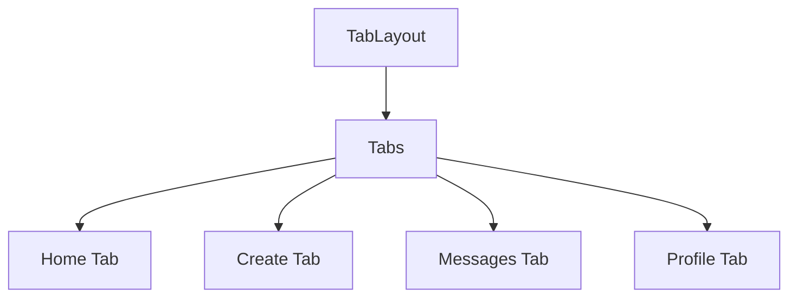

# Documentation for `TabLayout` Component

## Description
The `TabLayout` component is a React functional component that utilizes the `Tabs` component from the `expo-router` library to create a tabbed navigation interface for a mobile application. It defines four tabs: Home, Create, Messages, and Profile, each with its own icon and title. The component also adapts its appearance based on the device's color scheme (light or dark).

## Functions and Methods

### `TabLayout()`
This is the main function that renders the tab layout.

#### Parameters
- None

#### Return Value
- Returns a JSX element representing the tab layout with four screens.

#### Usage Example
```typescript
import TabLayout from './path/to/TabLayout';

export default function App() {
  return (
    <TabLayout />
  );
}
```

## Detailed Breakdown of the Code

### Imports
- `Tabs`: A component from `expo-router` for creating tabbed navigation.
- `React`: The core library for building user interfaces.
- `Platform`: A module from `react-native` to handle platform-specific code.
- `HapticTab`: A custom tab component that provides haptic feedback.
- `IconSymbol`: A custom component for rendering icons.
- `TabBarBackground`: A custom component for the tab bar background.
- `Colors`: A constants file that defines color schemes.
- `useColorScheme`: A custom hook to determine the current color scheme.

### Tabs Configuration
The `Tabs` component is configured with the following options:
- `headerShown`: Set to `false` to hide the header.
- `tabBarActiveTintColor`: Sets the active tab color based on the current color scheme.
- `tabBarButton`: Uses the `HapticTab` component for tab buttons.
- `tabBarBackground`: Uses the `TabBarBackground` component for the tab bar's background.
- `tabBarStyle`: Applies platform-specific styles, making the tab bar absolute on iOS.

### Tab Screens
Each tab is defined using `Tabs.Screen` with the following properties:

#### Home Tab
- **Name**: `index`
- **Title**: "Home"
- **Icon**: Renders an icon using `IconSymbol` with the name `house.fill`.

#### Create Tab
- **Name**: `create`
- **Title**: "Create"
- **Icon**: Renders an icon using `IconSymbol` with the name `plus.square.fill`.

#### Messages Tab
- **Name**: `chat`
- **Title**: "Messages"
- **Icon**: Renders an icon using `IconSymbol` with the name `bubble.left.fill`.

#### Profile Tab
- **Name**: `profile`
- **Title**: "Profile"
- **Icon**: Renders an icon using `IconSymbol` with the name `person`.

## Important Notes
- Ensure that the `HapticTab`, `IconSymbol`, and `TabBarBackground` components are correctly implemented and imported for the `TabLayout` to function properly.
- The `Colors` constant should include definitions for both light and dark color schemes to ensure proper styling based on the user's preference.
- The `useColorScheme` hook must be implemented to return the current color scheme of the device.

## Mermaid Diagram


This documentation provides a comprehensive overview of the `TabLayout` component, enabling developers to understand its structure and usage effectively.