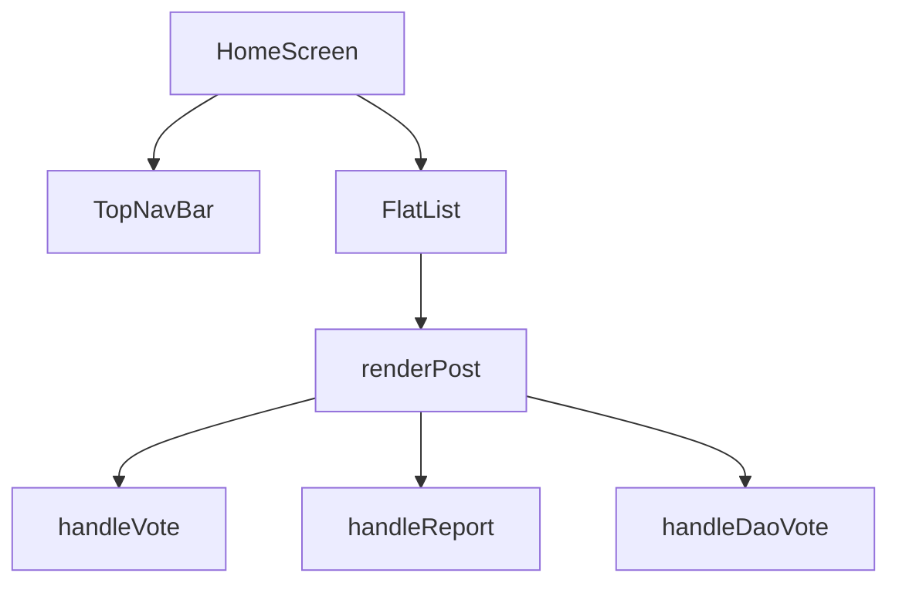

# Documentation for HomeScreen Component

## Overview
The `HomeScreen` component is a React Native functional component that displays a feed of posts related to various topics. It includes a navigation bar, a list of posts with user interactions (trust/untrust voting), and the ability to report posts. The component is designed to be responsive and works on both mobile and web platforms.

## Components

### 1. `TopNavBar`
- **Description**: A navigation bar that includes the app logo and action buttons for search, notifications, and user profile.
- **Usage**: Rendered at the top of the `HomeScreen`.

### 2. `HomeScreen`
- **Description**: The main component that manages the state of posts, handles user interactions, and renders the list of posts.
- **Usage**: This is the default export of the module.

## Functions and Methods

### `handleVote(id: string, type: "up" | "down")`
- **Parameters**:
  - `id`: The unique identifier of the post to vote on.
  - `type`: The type of vote, either "up" or "down".
- **Return Value**: None.
- **Usage Example**:
  ```typescript
  handleVote("1", "up");
  ```

### `handleReport(postId: string)`
- **Parameters**:
  - `postId`: The unique identifier of the post to report.
- **Return Value**: None.
- **Usage Example**:
  ```typescript
  handleReport("2");
  ```

### `handleDaoVote(postId: string, voteType: "trust" | "untrust")`
- **Parameters**:
  - `postId`: The unique identifier of the post to vote on.
  - `voteType`: The type of vote, either "trust" or "untrust".
- **Return Value**: None.
- **Usage Example**:
  ```typescript
  handleDaoVote("3", "trust");
  ```

### `updateVoteCount(postId: string, voteType: "trust" | "untrust", isUnvote: boolean = false)`
- **Parameters**:
  - `postId`: The unique identifier of the post.
  - `voteType`: The type of vote, either "trust" or "untrust".
  - `isUnvote`: A boolean indicating if this is an unvote (default is false).
- **Return Value**: None.
- **Usage Example**:
  ```typescript
  updateVoteCount("4", "untrust");
  ```

### `updateUserVote(postId: string, voteType: "trust" | "untrust" | null)`
- **Parameters**:
  - `postId`: The unique identifier of the post.
  - `voteType`: The type of vote, either "trust", "untrust", or null to remove the vote.
- **Return Value**: None.
- **Usage Example**:
  ```typescript
  updateUserVote("5", "trust");
  ```

### `getPostWidth()`
- **Parameters**: None.
- **Return Value**: A string representing the width of the post based on the platform.
- **Usage Example**:
  ```typescript
  const width = getPostWidth();
  ```

### `renderPost({ item, index })`
- **Parameters**:
  - `item`: The post object to render.
  - `index`: The index of the post in the list.
- **Return Value**: A JSX element representing the post.
- **Usage Example**:
  ```typescript
  renderPost({ item: localPosts[0], index: 0 });
  ```

## Important Notes
- The component uses `Animated` for fade-in effects when posts are rendered.
- The `FlatList` component is used for rendering the list of posts, which supports pull-to-refresh functionality.
- The component is responsive and adjusts the number of columns based on the platform (web or mobile).

## Mermaid Diagram


This documentation provides a comprehensive overview of the `HomeScreen` component, detailing its structure, functionality, and usage examples to assist developers in understanding and utilizing the code effectively.